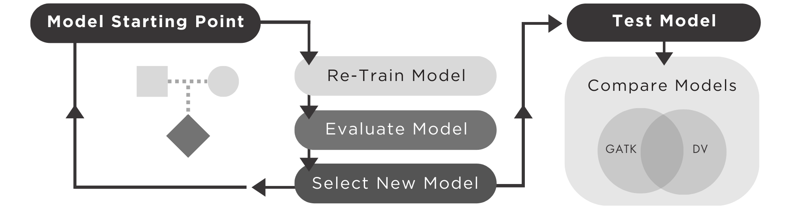

# DV-TrioTrain v0.8
DV-TrioTrain is an automated pipeline for extending DeepVariant (DV), a deep learning based variant caller. See the [original DeepVariant github page](https://github.com/google/deepvariant) to learn more.

## Background
The DeepVariant-TrioTrain pipeline works by iteratively feeding DeepVariant labeled examples from trio-binned, short-read (Illumina) Whole Genome Sequence (WGS) data. 

For each trio provided, TrioTrain will perform 2 iterations of re-training, one for each parent. The starting parent is a user-specified parameter, either "Mother" or "Father." With the first iteration, an existing DeepVariant model is used to initalize the weights and build upon prior learning. Subsequent iterations begin with a prior iteration's selected checkpoint.

As a training iteration proceeds, learning is evaluated using labeled examples from the parents' offspring. The same individual's genome is used for both iterations run for a trio. Our assumption is that a model trained on a parent genome will be better at genotyping variants inherited from that parent in the offspring's genome. Model weights that produce the maximum F1-score are selected for further testing, and to become the starting point for the next iteration. 

Testing occurs for all model iterations with a set of genomes previously unseen by the model. Variants are called with the model iterations, and then compared against a user-defined benchmark set with hap.py, a standardized benchmarking tool recommended by the Global Alliance for Genomic Health (GA4GH). See GA4GH's resources on [Germline Small Variant Benchmarking Tools and Standards](https://github.com/ga4gh/benchmarking-tools), or the [original Illumina hap.py github page](https://github.com/Illumina/hap.py) to learn more.

Current DeepVariant models were only trained on human data. Our work developing TrioTrain illustrates the limitations of applying models built exclusively with human-genome datasets in other species. Previous work built species-specific DeepVariant models for [mosquito genomes](https://google.github.io/deepvariant/posts/2018-12-05-improved-non-human-variant-calling-using-species-specific-deepvariant-models/), and the [endangered Kākāpō parot](https://www.biorxiv.org/content/10.1101/2022.10.22.513130v1.full). However, previous research has not assessed using DV with other mammalian species. 

We built TrioTrain to enable us to extend DeepVariant with cattle, bison, and yak genomes, and we provide an alternative checkpoint that extends upon v1.4 WGS DeepVariant model for use with the one-step, single-sample variant caller. TrioTrain serves as a template for producing similar research in other domestic animal species. Our work illustrates deep learning opportunities for species without variant reference materials. 
